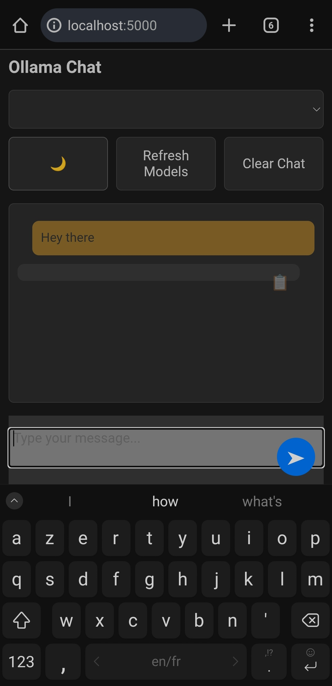

# 🤖 Andollama
Run Ollama locally on your old Android phone — no internet required! 🚀

### 🌟 What Is This?
Ever wished you could run LLMs like **Ollama** directly on your Android device — even an old one — completely offline?
**Andollama** makes it happen 🦙📱
<p align="center">
  
</p>

### ⚙️ Requirements

#### 🧩 Step 1 — Install Termux
Download the **Termux** APK from the official GitHub:
👉 [termux/termux-app/releases]()
Open Termux once installed — you’ll be living in the terminal from here on 👨‍💻
#### 🪄 Step 2 — Set Up Your Environment
Run these commands one by one in Termux:
```
pkg update
pkg upgrade
pkg install -y python python-pip git golang rust
```
#### 🧠 Step 3 — Clone and Build Ollama
```
git clone --depth=1 https://github.com/ollama/ollama.git
cd ollama
go generate ./...
go build .
./ollama --version
cd ..
```
(Grab a coffee — this part can take a while depending on your phone ☕)
#### 💾 Step 4 — Clone Andollama & install Dependencies
```
git clone --depth=1 https://github.com/okves054/andollama.git
python -m venv venv && source venv/bin/activate
cd andollama
pip install -U pip flask requests
cd ..
```
#### 🔥 Step 5 — Start server & Launch
```# Start Ollama server
./ollama/ollama serve &

# Run a small model
./ollama/ollama run qwen2.5:0.5b

# Start the web interface
python andollama/run.py
```
#### 🌐 Step 6 — Use It!
Open your phone’s browser and visit:
👉 http://localhost:5000
Boom 💥 — you’re chatting with a local AI running right on your Android device.
No cloud, no data leaks, no limits. 🧘‍♂️
#### 💡 Pro Tips
Want a different model? Replace **qwen2.5:0.5b** with any Ollama-supported model from [here](https://ollama.com/search).
To stop servers, just hit Ctrl + C or close Termux.
You can pin Termux to keep it running in the background 🔋
